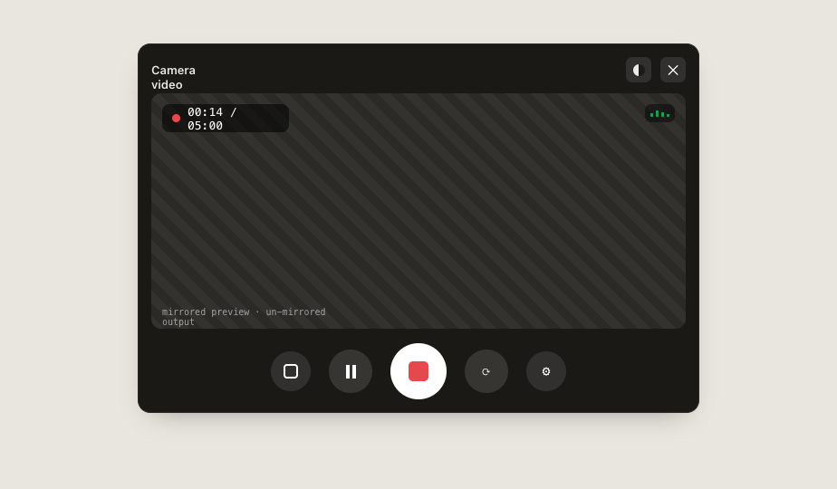

# Webcam & Microphone Screen Recorder

**VideoWhisper Webcam-Microphone-Screen-Recorder** is a self-hosted, browser-based recorder for webcam video, microphone audio, screen capture, photos, and screenshots. It runs in modern browsers and lets people preview, review, and explicitly accept media before it is uploaded.

[Try the official demo](https://demo.videowhisper.com/webcam-microphone-screen-recorder/) · [Contact VideoWhisper](https://consult.videowhisper.com/?department=Setup)



## Features

- Capture webcam video, microphone audio, screen video, photos, and screenshots.
- Select another available camera or microphone before capture.
- Review a result, retry it, or accept it for upload.
- Return browser-reported media details such as duration, dimensions, codecs, and frame rate where available.
- Use the recorder from React, a vanilla JavaScript page, an iframe, or the included PHP demo.
- Keep uploads on your own server through the multipart upload adapter.

## Capture implementation parameters and limitations

The recorder requests practical browser capture settings. The browser, selected device, operating system, and permission choice ultimately determine the delivered media settings.

- Webcam video requests a maximum 640px long edge at up to 30 fps (normally 640 × 360 landscape or 360 × 640 portrait) and records for up to five minutes.
- Screen recording requests 1280 × 720 and records for up to one minute.
- Webcam photos and screenshots preserve aspect ratio within a 1280px long edge.
- The recording durations help avoid large uploads and server or network timeouts in typical self-hosted installations.

The application is provided as is with its current implemented capabilities. A commercial VideoWhisper Pro release will expand on the available capabilities and configuration options.

## Quick deployment: PHP demo, no source build

Download the ready-to-deploy package from the latest GitHub release:

[Download the PHP demo ZIP](https://github.com/videowhisper/Webcam-Microphone-Screen-Recorder/releases/latest/download/videowhisper-webcam-microphone-screen-recorder-0.1.0.zip) · [View all releases](https://github.com/videowhisper/Webcam-Microphone-Screen-Recorder/releases)

1. Extract its top-level folder into an HTTPS-enabled web directory, for example `<document-root>/webcam-microphone-screen-recorder/`.
2. Use PHP 8.2+ with Apache, or configure your web server to route `api/*` to `api/index.php` and the browser app routes to `index.html`.
3. Make `api/app/storage/` writable by PHP.
4. Before public use, copy `api/app/config/credentials.example.php` to `api/app/config/credentials.php` and choose a unique administrator username, password, and HMAC secret.
5. Open the deployed folder in a browser and allow the required capture permission.

The package detects its deployed base path automatically; its default upload endpoint is the neighbouring `api/` directory. The ZIP includes a `DEPLOYMENT.md` with server-routing details.

## Run from source

Requirements: Node.js 20+ and npm. PHP 8.2+ is additionally required for the included upload/admin demo.

```bash
npm install
npm run build
npm run dev
```

Open the URL printed by Vite, allow browser media permissions, and choose a capture mode. For the browser app together with the PHP upload demo, run:

```bash
npm run dev:local
```

The local demo uses `http://127.0.0.1:5177/`; its PHP backend is served on port 8080. See [the PHP demo guide](server/php-demo/README.md) for deployment, media storage, and admin-security guidance.

## Build a deployment package from source

```bash
npm run package:demo
```

The command creates the same self-hosted demo ZIP used for the GitHub release. For most installations, download the release ZIP above instead of rebuilding it.

## WordPress integrations

The recorder is bundled by VideoWhisper's WordPress recorder plugins:

- [Video Posts Webcam Recorder](https://wordpress.org/plugins/video-posts-webcam-recorder/)
- [Video Comments Webcam Recorder](https://wordpress.org/plugins/video-comments-webcam-recorder/)

The plugins can save accepted media to the WordPress Media Library and expose recorder media information on the resulting attachment. Their integration options control which capture types are available in each workflow.

For shortcode examples, supported events, and instructions for updating the bundled app in those plugins, read [WordPress integration](docs/wordpress-integration.md).

## Verify changes

```bash
npm run typecheck
npm run test
npm run build
```

Run `npm run test:e2e` when Playwright browsers are installed and the change affects browser capture behavior.

## Security

Media capture requires a secure context (HTTPS, except localhost). Before putting the PHP demo on a public site, set unique administrator credentials and a unique HMAC secret in its protected configuration. Review [SECURITY.md](SECURITY.md) before deployment.

## License

This project is licensed under [GPL-2.0-or-later](LICENSE). See [LICENSES.md](LICENSES.md) for third-party and design-asset notices.
